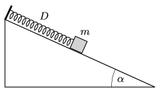

P. 4940. Egy $\alpha=30^\circ$-os hajlásszögű, rögzített lejtőn egy $m=0{,}8$ kg tömegű test az egyik végén rögzített, $D=30$ N/m direkciós erejű rugóhoz van kötve. A test és a lejtő közötti tapadási és csúszási súrlódás együtthatója egyarányt ${\mu=0{,}23}$. A testet a rugó nyújtatlan állapotában elengedjük.

 $a)$ Mekkora a test legnagyobb sebessége?
 $b)$ Mekkora a rugó legnagyobb megnyúlása?
 $c)$ Hol áll meg véglegesen a test?

