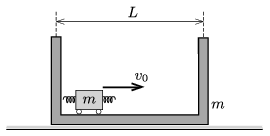

P. 4946. Egy $m$ tömegű kiskocsi szabadon mozoghat egy szintén $m$ tömegű doboz belsejében. A doboz vékony olajréteggel borított asztalon mozoghat, a súrlódási erő csak a doboz sebességétől függ: ${\boldsymbol F=-k\boldsymbol v}$. Kezdetben a doboz áll, a kiskocsi a bal oldali faltól indulva $v_0$ nagyságú sebességgel kezd mozogni jobbra. Hányszor fog rugalmasan ütközni az $\ell$ hosszúságú kiskocsi az $L$ hosszú dobozzal? (A rugalmas ütközést a kiskocsin lévő rugók biztosítják, ezek hossza sokkal kisebb, mint $\ell$.)

 A Kvant nyomán

