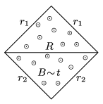

P. 4957. Egy négyzet alakú drótkeret oldalélei az  ábrán látható $r_1$ és $r_2$ ellenállású huzalokból készültek. A keret az ábra síkjára merőleges, homogén, időben egyenletesen növekvő mágneses indukciójú mezőben van. Mekkora $R$ ellenállású vezetéket kapcsoljunk a négyzet átlójára, hogy az a leggyorsabb ütemben melegedjen?

 Izsák Imre Gyula verseny (Zalaegerszeg) feladata nyomán

