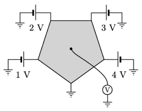

P. 4959. Egy szabályos ötszög alakú, vékony fémlemez egyik csúcsát leföldeljük, a többire az ábrán látható módon kis belső ellenállású feszültségforrásokat kapcsolunk. Mekkora feszültséget mutat a lemez középpontjához kapcsolt voltmérő?

 Példatári feladat nyomán

