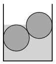

P. 4962. Egy függőleges falú, vizet tartalmazó csatornában két 45 kg tömegű, henger alakú farönk található. Méretük és anyagi minőségük azonos, egymással és a csatorna falával érintkeznek. Az egyiket éppen ellepi a víz, a másik félig merül be a vízbe. A súrlódás mindenhol elhanyagolható.

 $a)$ Mekkora a farönkök sűrűsége?
 $b)$ Mekkora erőkkel nyomják a farönkök a függőleges falakat?

