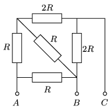

P. 4968. Egy elektromos főzőlap fűtőszálait az  ábra szerint lehet kapcsolni. Ha az $A$–$B$ pontokra adjuk a feszültséget, akkor $m$ tömegű vizet lehet felforralni egy bizonyos idő alatt. Mennyi vizet lehet felforralni ennyi idő alatt, ha a feszültséget a $B$–$C$, illetve az $A$–$C$ pontokra kapcsoljuk?

