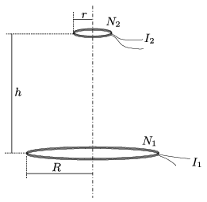

P. 4969. Két lapos tekercs közös szimmetriatengelyen, egymástól $h$ távolságra az  ábrán látható módon helyezkedik el. A tekercsek menetszáma $N_1$, illetve $N_2$, sugaruk $R$ és $r$ ($r\ll R$), valamint $I_1$, illetve $I_2$ erősségű áram folyik bennük. Mekkora erőt fejt ki egymásra a két tekercs?

 A Kvant nyomán

