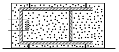

P. 4983. Rögzített, hővezető falú, zárt tartály belsejéhez az  ábra szerint egy hőszigetelt falú henger van erősítve. A hengerben lévő 1 dm$^2$ keresztmetszetű, hőszigetelő dugattyú súrlódásmentesen mozoghat. Kezdetben a hengerben is és a tartályban is 2,6 dm${}^3$ térfogatú, $10^5$ Pa nyomású és 27 $^\circ$C hőmérsékletű levegő van.

 A hengerben lévő levegőt egy fűtőszállal melegíteni kezdjük, eközben a tartályban lévő levegő hőmérséklete állandó marad.
 $a)$ Mennyivel mozdul el a dugattyú, ha a hengerben lévő levegő hőmérséklete 77 $^\circ$C-ra nő?
 $b)$ Ábrázoljuk vázlatosan a hengerben lévő gáz állapotváltozását a $p$–$V$ állapotsíkon!
 $c)$ Becsüljük meg, mennyi hőt vesz fel a hengerben lévő levegő!

