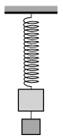

P. 4991. Egy állványon függő csavarrugóra egymás alá két, fonállal összekötött, összesen 4 kg tömegű testet erősítettünk az  ábra szerint. Ha az alsó test leesik, a rugón maradó rezgőmozgásba jön. Ha a két testet felcseréljük, és ezután esik le az alsó test, a felső ismét rezegni fog. A két rezgésidő különbsége 0,3 s. Mekkora a két test tömege külön-külön, ha együtt a rugón 1,5 s periódusidejű rezgést végeznek?

