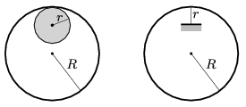

P. 5026. Egy $m$ tömegű és $R$ sugarú, vékony gyűrűt kétféleképpen hozunk kis kitérésű lengésbe. Az egyik esetben egy $r$ sugarú, vízszintes tengelyű hengerre fűzzük fel a gyűrűt, kissé kitérítjük, majd elengedjük. A másik esetben egy $r$ hosszúságú, elhanyagolható tömegű, vékony tűt ragasztunk a gyűrűbe úgy, hogy a tű a gyűrű közepe felé mutasson, és a gyűrű erre a tűre támaszkodjon lengés közben. A gyűrű mindkét esetben síkmozgást végez.

 Melyik esetben hosszabb a lengésidő?

