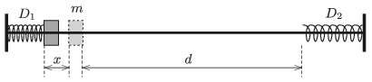

P. 5067. Egy súrlódásmentes rúdra felfűzünk két könnyű rugót, amelyek rugóállandója $D_1$, illetve $D_2$. A rugók egyik vége rögzített, másik végeik közötti távolság $d$. A rúdra felfűzött $m$ tömegű, kis méretű testtel együtt az egyik rugót $x$-szel összenyomjuk, majd a testet elengedjük.

 Mennyi idő múlva tér vissza elindulási helyére az $m$ tömegű kis test? Függ-e ez az idő attól, hogy melyik rugóról indítjuk a testet?

