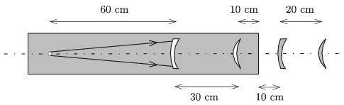

P. 5075. Az ábra szerinti elrendezésben közös optikai tengelyen, egymással párhuzamosan négy vékony lencse helyezkedik el. Mindegyik lencse határfelületének görbületi sugara 5 cm, illetve 10 cm. Kettő közülük $n=1{,}5$ törésmutatójú üvegben lévő levegőlencse, kettő pedig ugyanilyen törésmutatójú üveglencse.
 Az üvegben, az optikai tengelyen, a domborúan homorú lencsétől 60 cm-re egy pontszerű fényforrás van. A lencse másik oldalán, tőle 30 cm távolságra helyezkedik el a homorúan domború levegőlencse. Ettől 10 cm távolságra van az üveget határoló sík felület, amely merőleges az optikai tengelyre. A sík felülettől 10 cm-re található az üvegből készült domborúan homorú lencse, a negyedik (homorúan domború) lencse pedig a harmadiktól 20 cm-re van.

 A négy lencse hová képezi le a pontszerű fényforrást?

