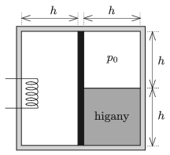

P. 5077. Egy téglatest alakú, hőszigetelő falú tartály közepén jó hővezető anyagból készült dugattyú helyezkedik el. A dugattyútól balra $V_0$ térfogatú levegő van, a dugattyútól jobbra $V_0/2$ térfogatú, $p_0=76~{\rm Hgcm}\approx 10^5$ Pa nyomású levegő és $h=38$ cm magas higanyoszlop található. A tartály teljes szélessége (a dugattyú vastagságán felül) $2h$, magassága szintén $2h$.

 Egy beépített fűtőszállal lassan melegíteni kezdjük a bal oldali térrészt. A gázok hőmérséklete minden pillanatban megegyezik. Legfeljebb mekkora lehet a dugattyú elmozdulása, ha a higany, a tartály és a dugattyú hőtágulásától eltekintünk?

