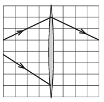

P. 5085. A mellékelt (méretarányos) ábra felső felén egy vékony, hagyományos gyűjtőlencsén áthaladó fénysugár menete látható. Hogyan fog továbbhaladni ugyanezen a lencsén az  ábra alsó felén látható fény­sugár?

