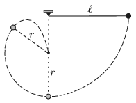

P. 5088. Egy $\ell$ hosszúságú fonálingát vízszintesen kitérítünk, majd elengedünk. Amikor a fonál eléri a függőleges helyzetét, egy szögbe ütközik, s innen kezdve már csak az alsó, $r$ hosszúságú része lendül tovább.

 Mekkora az $r/\ell$ arány, ha az ingatest, miután felfelé haladva letér valahol a körpályáról, szabadon mozogva pontosan a szögbe ütközik?

