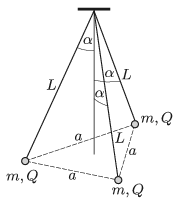

P. 5094. Három, $L=20~$cm hosszúságú szigetelőfonál egyik végéhez $m=1~$g tömegű, pontszerűnek tekinthető testeket erősítettek, amelyek töltése (egyenként) $Q=3{,}1\cdot 10^{-7}$ C. A fonalak másik végét közös pontban rögzítették. Kezdetben a feszes fonalak a függőlegessel $\alpha=30^\circ$-os szöget zárnak be, és a kis testek egy szabályos háromszöget alkotnak. Ezt követően egyszerre elengedjük a testeket.

 $a)$ Mekkora szöget zárnak be a fonalak a függőlegessel, amikor a testek sebessége maximális?
 $b)$ Mekkora a testek legnagyobb sebessége?

