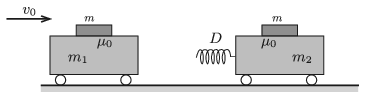

P. 5102. Vízszintes talajon $m_1$ tömegű kiskocsi $v_0$ sebességgel halad az álló, $m_2$ tömegű kiskocsi felé. Mindkét kocsin egy-egy $m$ tömegű, lapos hasáb van. A hasábok és a kiskocsik felülete közötti tapadási súrlódási együttható $\mu_0$. Az álló kiskocsin $D$ rugóállandójú nyomórugó van.

 Ütközéskor megcsúszik-e valamelyik hasáb?
 Adatok: $m_1=0{,}2~\rm kg$; $m_2=m=0{,}1~\rm kg$; $\mu_0=0{,}5$; $D=12~\rm N/m$; $v_0=1~\rm m/s$.

