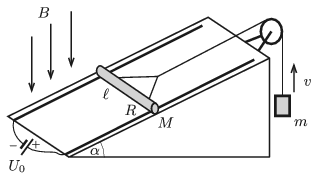

P. 5118. Egy $\alpha=30^\circ$-os hajlásszögű lejtőhöz két, egymástól $\ell=10$ cm távolságra lévő, egymással párhuzamos, elhanyagolható ellenállású sín van rögzítve, melyeket az egyik végüknél állandó $U_0$ feszültségű áramforrás kapcsol össze. A sínekre merőlegesen egy $M=30$ g tömegű, $R=0{,}2~\Omega$ ellenállású, vízszintes fémpálcát fektettünk, amely a síneken súrlódásmentesen mozoghat. A pálca közepéhez a sínekkel párhuzamos fonál csatlakozik, melynek elhanyagolható tömegű csigán átvetett függőleges darabjához egy $m=50~$g tömegű nehezék van erősítve. A berendezés függőlegesen lefelé mutató, $B=0{,}5$ T indukciójú, homogén mágneses mezőben van.

 Mekkora legyen az áramforrás feszültsége, hogy az $m$ tömegű nehezék
 $a)$ függőlegesen felfelé,
 $b)$ függőlegesen lefelé $v=10~$m/s sebességgel egyenletesen haladjon?

