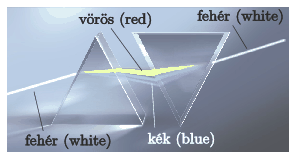

P. 5119. Newton híres kísérletében (experimentum crucis) a fehér fényt színekre bontotta prizma segítségével. A színes fénysugarakat újra egyesítette fehér fénnyé. Megvalósítható-e a fehér fény felbontása és újraegyesítése a  képen látható módon?

 Az internet nyomán

