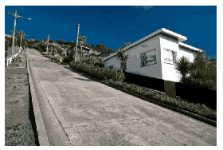

P. 5122. Egy autó fékútja száraz, vízszintes aszfalton 50 km/h sebességnél legalább 13 méter, azaz ennyi utat tesz meg az autó a fékezés megkezdésétől a megállás pillanatáig. (A fékút definíciójában nem szerepel sem az ember, sem az autó reakcióideje.)

 Mekkora ugyanennek az autónak a minimális fékútja 20 km/h sebességnél egy szokatlanul meredek, $30^\circ$-os hajlásszögű (kb. 58%-os!) lejtőn? Vizsgáljuk a felfelé és a lefelé haladás esetét is!

