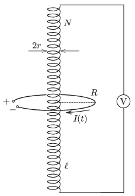

P. 5129. Egy $r$ sugarú, $N$ menetszámú, igen hosszú, $n=N/\ell$ menetsűrűségű szolenoidot az  ábrán látható módon egy $R\ll \ell$ sugarú körvezetővel vettünk körül. Mekkora értéket mutat a szolenoid végpontjai közé kapcsolt ideális voltmérő, ha a körvezetőbe időben egyenletesen, $I(t)=\alpha\cdot t$ módon változó áramot vezetünk?

