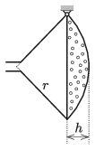

P. 5156. Vékony lemezből készült öntözőkanna gömbcikk alakú rózsáját peremkörének egyik pontjánál az  ábrán látható módon csuklósan rögzítettük. Mekkora a $h/r$ arány, ha egyensúlyi állapotban a test tengelye vízszintes? (A vékony lemez homogén, állandó vastagságú. A rózsa vízbevezető csövecskéjének méretét és a kifolyónyílások összes területét tekintsük elhanyagolhatóan kicsinek.)

