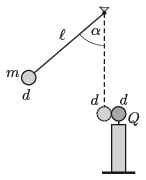

P. 5160. Rögzített szigetelőállvány tetejére erősített kicsiny, $d=2$ cm átmérőjű fémgömb töltése $Q=8\cdot 10^{-9}$ C. Vékony, $\ell=1$ m hosszú, az  ábra szerint felfüggesztett szigetelőszál végére erősített ugyanakkora semleges fémgömb tömege $m=1$ g. A fonalat $\alpha=60^\circ$-ig kitérítjük, majd elengedjük. A két gömb centrálisan, abszolút rugalmasan ütközik. Az ütközés során az elektromos mező energiája nem változik, energiadisszipáció nincsen.

 A kiindulási helyzeténél mennyivel kerül magasabbra a fonálinga kis gömbje, ha a légellenállás is elhanyagolható?
 (Lásd még a kapacitásokról szóló cikket lapunk 425. oldalán.)

