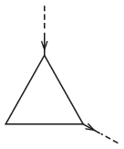

P. 5171. Huzalból egyenlő oldalú háromszöget készítettünk, és két csúcsát az  ábra szerint áramforráshoz kapcsoltuk. A hozzá vezető vezetékben 10 A erősségű áram folyik. Mekkora a mágneses indukció a háromszög középpontjában? (Az áramkör távol zárul.)

