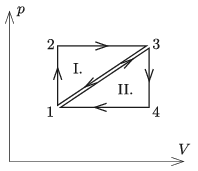

P. 5191. Ugyanannyi ideális gázzal az  ábra szerinti $p\,$–$\,V$ diagramon ábrázolt $1\rightarrow2\rightarrow3\rightarrow1$, illetve az $1\rightarrow3\rightarrow4\rightarrow1$ körfolyamatot végeztetjük. Melyik körfolyamatot végző gépnek nagyobb a hatásfoka, és milyen összefüggés áll fenn a két hatásfok között?

 Varga István (1952–2007) feladata

