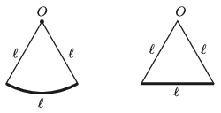

P. 5199. Az ábrán látható $\ell$ hosszú, körív alakú, vékony (de kellően merev) fémhuzal mindkét végpontját $\ell$ hosszúságú, igen könnyű fonállal a körív $O$ középpontjához erősítjük. Az így elkészített inga az  ábra függőleges síkjában $T_1$ periódusidejű, kis kitérésű lengéseket végezhet az $O$ pont körül. Ha a fémhuzalt kiegyenesítjük, az így átalakított test az ábra síkjában $T_2$ periódusidejű, kis kitérésű lengéseket végezhet. Mekkora a $T_2/T_1$ arány?

