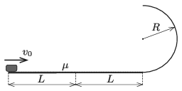

P. 5211. Mekkora kezdősebességgel kell meglökni a $2L$ hosszúságú, vízszintes pálya elején álló kis testet, hogy a vízszintes pálya végén lévő $R$ sugarú, függőleges félkör alakú pályán végigcsúszva a vízszintes szakasz felezőpontjába csapódjon be?

 A vízszintes pályán a súrlódási együttható $\mu$, a félkör alakú pálya súrlódásmentes.
 Adatok: $L=2$ m; $R=0{,}5$ m; $\mu=0{,}4$.

