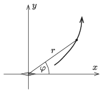

P. 5218. A derékszögű koordináta-rendszer origójában elhelyezett kicsiny, ,,pontszerű'' mágnestű az $x$ tengely irányába mutat. Egyik mágneses erővonalának egyenlete $r=r_0\sin^2\varphi$, ahol $r$ és $\varphi$ az erővonal egy-egy pontjának ún. polárkoordinátái.

 $a)$ Írjuk fel ennek az erővonalnak az egyenletét $x$ és $y$ koordinátákkal kifejezve, ha $r_0=3$ méter!
 $b)$ Az erővonalnak hol vannak olyan pontjai, ahol a mágneses indukcióvektor iránya merőleges a mágnestűre?

