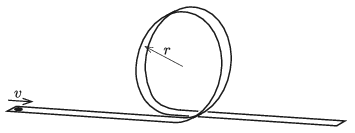

P. 5221. Egy piciny (pontszerűnek tekinthető) játékautónak építünk egy súrlódásmentes pályát, amely vízszintes szakasszal indul, azután egy $r$ sugarú, függőleges síkú, kör alakú hurokban folytatódik, majd a hurok kezdetéhez visszaérve ismét vízszintessé válik. Legyen $v$ az a legkisebb indítási sebesség, amellyel a kisautó már végighalad a pályán. Ezen $v$ sebesség hányad részével kell elindítani az autót, hogy a hurokszakaszról leválva éppen a kör átellenes pontjába csapódjon majd be?

