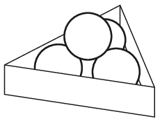

P. 5223. Vízszintes asztallapon az  ábrán látható módon elhelyeztünk négy egyforma, egyenként 30 N súlyú golyót egy keretben, amely egy szabályos háromszög alapú hasáb. Mekkora erők hatnak az egyes érintkezési pontokban, ha a háromszög oldala 15 cm, a golyók átmérője pedig 5 cm? (A súrlódástól eltekinthetünk.)

