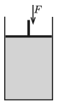

P. 5234. Az ábra szerinti, függőleges szimmetriatengelyű, hengeres tartályt felül egy súlytalannak tekinthető dugattyú zár el. A 7 dm${}^3$ térfogatú edényben nincs levegő, csak $T$ hőmérsékletű, telített vízgőzt tartalmaz. Mekkora munkát végzünk, ha a dugattyút lassan addig nyomjuk le, míg az folyadékba nem ütközik? A folyamat során az egész rendszer hőmérséklete állandó. Számítsuk ki és ábrázoljuk a végzett munkát a $T$ hőmérséklet függvényében, ahol $100\;{}^\circ\mathrm{C}\le T\le 370\;{}^\circ\mathrm{C}$. (A telített vízgőz nyomására, sűrűségére és a víz sűrűségére vonatkozó adatokat vegyük a Négyjegyű függvénytáblázatokból!)

