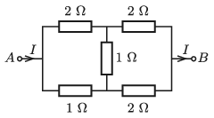

P. 5237. Az ábrán látható ellenállásrendszer $A$ pontjában 40 mA erősségű áram folyik be, és a $B$ pontnál folyik ki.

 $a)$ Mekkora áram folyik át az egyes ellenállásokon?
 $b)$ Mekkora az egyes ellenállásokra eső elektromos teljesítmény?
 $c)$ Mekkora egyetlen ellenállással lehetne helyettesíteni az ellenállásrendszert?

