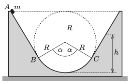

P. 5251. Az $m$ tömegű, kis méretű testet az  ábrán látható, rögzített hasáb $A$ pontjában kezdősebesség nélkül elengedjük. A test a bal oldali egyenes szakaszon és az $R$ sugarú köríven súrlódásmentesen csúszik. A jobb oldali egyenes szakasz nem súrlódásmentes, a súrlódási tényező $\mu$.

 $a)$ Mekkora erővel nyomja a test a hasábot a pálya legmélyebb pontján?
 $b)$ Mekkora a test sebessége a $C$ pontban?
 $c)$ Milyen $h$ magasságba emelkedik fel a test?
 Adatok: $m =0{,}6$ kg, $R = 30$ cm, $\alpha = 60^\circ$, $\mu = \frac12 \tan\alpha$.

