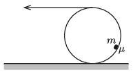

P. 5252. $M$ tömegű, vékony falú csőre fonalat csévélünk, és a fonalat húzva az  ábrán látható módon a csövet állandó sebességgel gurítjuk. A cső tisztán gördül a vízszintes talajon. A cső belsejébe kis méretű, $m$ tömegű testet helyeztünk, ami odabent állandósult szöghelyzetben csúszik, a súrlódási együttható itt $\mu$. Mekkora vízszintes fonálerő szükséges az állandó sebesség fenntartásához?

