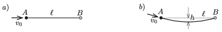

P. 5271. Egy pontszerű test az  ábrán látható kétféle útvonalon juthat el az $A$ pontból az $\ell$ távolságban lévő $B$ pontig. Az $a)$ esetben a test vízszintes egyenes pályán mozog, a $b)$ esetben pedig egy függőleges síkban elhelyezkedő, $h$ mélységű körív mentén. Mindkét mozgás kezdősebessége $v_0$. Melyik mozgás tart hosszabb ideig? (A súrlódás és a légellenállás elhanyagolható.)

 Adatok: $v_0=1$ m/s, $\ell=1$ m, $h=2{,}5$ cm.

