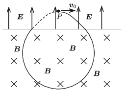

P. 5290. Homogén elektromos mező $P$ pontjából egy pontszerű, negatív töltésű részecskét lövünk ki az elektromos térre merőleges $\boldsymbol v_0$ kezdősebességgel. Az $\boldsymbol E$ elektromos térerősségre és a $\boldsymbol v_0$ sebességvektorra merőleges, homogén mágneses mező is jelen van. A kétféle mezőt egy, az elektromos térerősségre merőleges sík választja el egymástól az ábra szerint. Mekkora a mágneses indukcióvektor nagysága, ha a részecske visszatér a $P$ pontba?

 (Az egész elrendezés vákuumban van, és a nehézségi erő hatása a részecskére elhanyagolható.)

