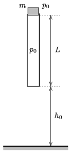

P. 5302. Az ábrán látható alul zárt, $A$ keresztmetszetű, felül nyitott csövet függőleges helyzetben tartjuk úgy, hogy egy $m$ tömegű, benne könnyen csúszó, a csőből kissé kiérő tömör, nehéz dugattyút is fogunk.

 A külső $p_0$ légnyomás és a belső nyomás kezdetben megegyezik. A bezárt légoszlop kezdeti hossza $L$. A cső alja a vízszintes talajtól $h_0$ magasságra van. A külső és a kezdeti belső hőmérséklet $T_0$. Ezt a rendszert egy adott pillanatban kezdősebesség nélkül elengedjük. A cső alja az ütközéskor hozzátapad a talajhoz. (A csőben a súrlódás, valamint a külső légkörbeli közegellenállás elhanyagolható.)
 $a)$ Mekkora lesz a maximális hőmérséklet a csőben?
 $b)$ Mekkora lesz a dugattyú legnagyobb gyorsulása?
 $c)$ Milyen magasra emelkedik a csőből kirepülő dugattyú?
 Adatok: $A = 0{,}25~\mathrm{dm}^2$, $m = 0{,}5$ kg, $p_0 = 10^5$ Pa, $L = 0{,}8$ m, $h_0 = 0{,}6$ m, $T_0=300$ K.

