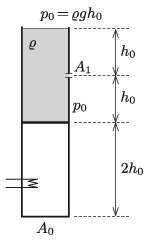

P. 5314. Egy függőleges, jól hőszigetelt, felül nyitott, $A_0$ keresztmetszetű hengert két részre oszt egy szintén hőszigetelő anyagból készült, elhanyagolható vastagságú és tömegű dugattyú. A dugattyú alatti $2h_0$ magasságú térrészben levegő, míg felette $2h_0$ magasságban $\varrho$ sűrűségű folyadék található. A dugattyú felett $h_0$ magasságban a folyamat kezdetén megnyitunk egy apró, $A_1$ keresztmetszetű nyílást, melyen a folyadék elkezd kifolyni a hengerből. A számítások során a légköri nyomás értékét vegyük $p_0=\varrho gh_0$-nak.

 $a)$ Hogyan változtassuk az elzárt levegőt melegítő fűtőszál teljesítményét az idő függvényében, hogy a folyadék állandó sebességgel folyjon ki a nyíláson?
 $b)$ Mennyi ideig tudjuk biztosítani a folyadék állandó sebességű kiáramlását, és ezen időpont után ez már miért nem oldható meg a fűtőszállal?

