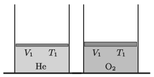

P. 5321. Függőleges, alul zárt hengerekben lévő, különböző tömegű, súrlódásmentesen mozgó dugattyúk azonos térfogatú, azonos hőmérsékletű hélium-, illetve oxigéngázt zárnak el. A gázokat lassan azonos hőmérsékletre melegítjük fel. A melegítés során az oxigén belsőenergia 2,5-szer, a tágulási munkája pedig 220 J-lal nagyobb, mint a hélium esetében.

 $a)$ Határozzuk meg a gázok kezdeti nyomásának arányát!
 $b)$ Mennyit hőt közöltünk a melegítés során a héliummal, illetve az oxigénnel?

