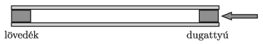

P. 5331. Régi, népi játékszer a ,,krumplilövettyű'', ami egy 12 cm hosszú, 0,3 cm$^2$ belső keresztmetszetű bodzacső. A cső két végét egymás után egy-egy 1 cm hosszúságú krumplihengerrel dugaszoljuk el.

 Az egyik krumplidugó a lövedék, a másik pedig a dugattyú szerepét tölti be. A krumplihengerek jól tömítik a csövet, egy ilyen henger megmozdításához (a tapadás legyőzéséhez) legalább 4 N erőt kell kifejtenünk. A csőben mozgó krumplidugóra 3,5 N nagyságú súrlódási erő hat. Miközben a lövedék távozik a bodzacsőből, a rá ható súrlódási erő a csőben lévő hosszával egyenesen arányosan csökken 0-ra. (A krumpli sűrűsége 1,06 g/cm$^3$, a külső légnyomás $10^5$ Pa.)
 $a)$ Mennyi a mindkét végén lezárt, ,,megtöltött'' állapotban lévő lövettyűben lévő levegő nyomása?
 $b)$ Egy fapálca segítségével a dugattyút lassan addig toljuk a csőben, amíg a lövedéknek szánt krumplihenger egy pukkanás kíséretében hirtelen ki nem repül. Mennyi munkát kell végeznünk a megtöltött lövettyű elsütéséhez?
 $c)$ Mekkora sebességgel hagyja el a lövedék a csövet?

