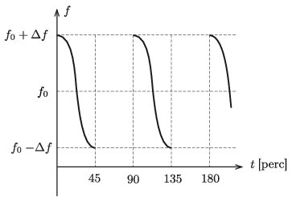

P. 5340. A földönkívüli civilizációk után kutatók egyik nagy rádiótávcsöve egy távoli égitest irányából az  ábrán látható furcsa, változó frekvenciájú jeleket észlelte. A jelek 45 percen keresztül folyamatosan érkeztek, utána 45 perc szünet következett, majd ismét 45 percnyi jel stb. Az észlelt jel frekvenciájának középértéke $f_0=1{,}5$ GHz, és a változó frekvencia $f_0$ körül $\Delta f=40$ kHz értékkel ingadozott.

 Az észlelt rádióhullámokat egy exobolygó körül keringő exoműhold állandó frekvenciájú jeleként értelmezték a kutatók. Feltételezték, hogy a Föld és az exobolygó közötti egyenes szakasz az exoműhold pályájának síkjában fekszik, és így meg tudták határozni a bolygó tömegét, sugarát és az átlagsűrűségét. Milyen értékeket kaptak?
 A Kvant nyomán

