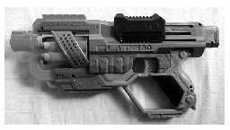

P. 5374. A képen egy sorozatlövő, rugós játékpuska látható, ami hat darab, vékony, henger alakú szivacslövedéket képes kilőni. Minden egyes lövés előtt a fekete csúszkát jobbra el kell húzni ütközésig, nagyjából 10 cm-re. A puska felhúzásához szükséges maximális erőről egy digitális testsúlymérleg segítségével azt találtuk, hogy ez az erő 6,6 kg-os tömeg súlyának felel meg.

 $a)$ Hogyan történhetett az erő meghatározása, ha a mérlegen kívül semmilyen segédeszközt nem kellett igénybe venni?
 $b)$ Becsüljük meg, hogy maximálisan mekkora sebességgel repül ki a 3 g tömegű szivacslövedék, ha a rugó összes energiájának 10%-a fordítódik a lövedék gyorsítására!

