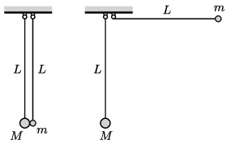

P. 5393. Egy $m$ tömegű és egy $M = 3m$ tömegű, kicsiny golyóhoz fonalakat erősítünk, melyek másik végét a  bal oldali ábra szerint azonos magasságban rögzítjük. A golyók középpontja ekkor a felfüggesztés alatt $L$ mélységben van. A kisebb tömegű golyót felemeljük úgy, hogy a hozzá kapcsolódó fonál vízszintes legyen ( jobb oldali ábra ), majd a golyót elengedjük. A két golyó tökéletesen rugalmasan és egyenesen ütközik.

 $a)$ Az ütközés előtti pillanatban mekkora együttes erővel terheli a két fonál a felfüggesztést?
 $b)$ Mekkora a terhelés az ütközés utáni pillanatban?
 $c)$ Az első és a második ütközés között mekkora a két fonál által bezárt legnagyobb szög?
 $d)$ A $c)$ esetben mekkora nagyságú, és milyen irányú az együttes terhelés?
 $e)$ Mekkora szöget zárnak be a fonalak a függőlegessel, amikor bekövetkezik a második ütközés?

