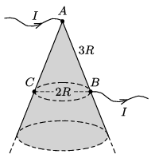

P. 5399. Egy vékony, $\delta$ vastagságú fémlemezből nagy, kúp alakú felületet hegesztettünk össze. A kúp $A$-val jelölt csúcsába $I$ erősségű áramot vezetünk, majd az egyik alkotón lévő $B$ pontból elvezetjük azt. Határozzuk meg a $B$-vel átellenes $C$ pontban az áramsűrűség-vektor irányát és nagyságát! Ismert, hogy az $AB$ távolság értéke $3R$, míg a $B$ és $C$ pontok távolsága $2R$.

