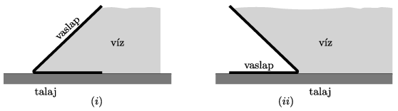

P. 5403. Valaki egy olyan mobilgát építését javasolta, ami egy vízszintes és hozzá $45^\circ$-os szögben csatlakozó vaslapból áll. A két fémlapnak a közös élre merőleges mérete 1 méter, illetve $\sqrt2$ méter, a fémlapok vastagsága 2 cm. ,,Ezt a szerkezetet nemcsak a vaslapok súlya, de még a víz nyomása is a talajhoz szorítja'' – érvelt a feltaláló.
 $a)$ Legalább mekkora (tapadási) súrlódási együtthatóra van szükség a mobilgát és a talaj között, hogy a védelem még a maximális vízmagasság esetén is biztonságos legyen?
 $b)$ Hol lehet az ilyen alakú mobilgátakon a talaj által kifejtett függőleges nyomóerő támadáspontja, ha 2 cm-nél vastagabb, vagy vékonyabb vaslapot alkalmazunk? Felborulhat-e a mobilgát a legmagasabb vízállásnál (vagyis amikor a víz éppen a ferde vaslap tetejéig ér)?
 Vizsgáljuk meg a mobilgát elhelyezésének kétféle lehetőségét:
 $(i)$ a ferde felület a víz felé dől;
 $(ii)$ a ferde felület a védendő terület felé dől.

