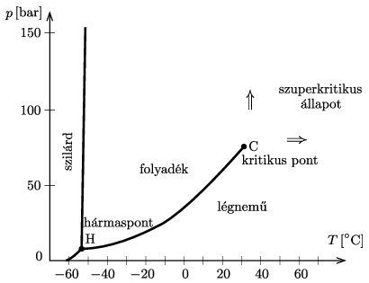

P. 5412. Ha egy gázt (állandó nyomás mellett) lehűtünk, akkor elegendően alacsony hőmérsékleten a gáz általában cseppfolyósodik (kondenzálódik, lecsapódik). Ez azonban csak bizonyos nyomástartományban történik így. Az  ábra a szén-dioxid ,,fázisdiagramját'' mutatja. Legalább, illetve legfeljebb mekkora nyomás mellett történik meg a cseppfolyósodás a fenti módon? Mi történik, ha a hűtést ennél a tartománynál magasabb, illetve alacsonyabb nyomáson végezzük?

 (Lásd még ,,A gőz, gáz és a kritikus hőmérséklet'' c. rövid cikket a KöMaL honlapján: https://www.komal.hu/cikkek/cikklista.h.shtml .)

