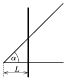

P. 5415. Egy elhanyagolható ellenállású, szigetelés nélküli huzalból, a vízszintes síkban elhelyezkedő, $\alpha= 45^\circ$-os szöget bezáró, V alakot hajlítunk. Ezt az elrendezést olyan mágneses mezőbe helyezzük, melynek $\boldsymbol B$ indukcióvektora merőleges a vízszintes síkra, és nagysága a $B(t) = B_0/t_0\cdot t$ összefüggés szerint változik az időben, ahol $B_0$ és $t_0$ ismert állandók. A V alakú vezetőre szigetelés nélküli, kezdetben rögzített fémrudat helyezünk az  ábrának megfelelő módon. A rúd egységnyi hosszúságú darabjának ellenállása $r$.

 $a)$ Mennyi hő fejlődik a fémrúdban $t_0$ idő alatt?
 $b)$ A bekapcsolástól ($t = 0$ időpillanat) számított $t_0$ időpillanatban a mágneses indukció változása megszűnik. Ebben a pillanatban az eddig rögzített fémrudat a vízszintes síkban, a fémrúdra merőlegesen $v_0$ sebességgel mozgatni kezdjük. Mekkora legyen ez a sebesség, hogy a rúdban folyó áram erőssége ne változzon?
 $c)$ Hányszor több hő fejlődik a fémrúdban a mozgatás során, mint a rögzített helyzetben, ha a fémrudat $2t_0$ hosszú ideig mozgatjuk?

