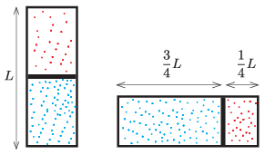

P. 5422. Egy zárt, henger alakú, $L=40$ cm hosszúságú, hővezető falú tartályt egy vékony dugattyú oszt két részre, amelyekben ideálisnak tekinthető gáz található. Kezdetben a tartály tengelye függőleges, a dugattyú pedig egyensúlyi állapotában éppen a tartály felénél helyezkedik el. Ezután a tartály szimmetriatengelyét $90^\circ$-kal lassan elforgatjuk, melynek eredményeképp a dugattyú $10$ cm távolsággal mozdul el. Mennyivel mozdult volna el a dugattyú, ha $90^\circ$ helyett $180^\circ$-kal forgattuk volna el a tartályt? A hőmérséklet mindvégig állandó.

 Példatári feladat nyomán

