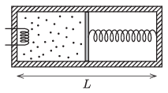

P. 5457. Hőszigetelt, hengeres tartály belső hossza $L$. A tartályt egy hőszigetelő dugattyú két részre osztja; a bal oldali térfélben egyatomos ideális gáz, a jobb oldaliban vákuum van (lásd az  ábrát ). A dugattyút a tartály jobb oldali végével rugó köti össze, melynek feszítetlen hossza $L$. A gázt a bal oldali térfélben lévő fűtőszál segítségével lassan melegíteni kezdjük.

 Határozzuk meg a gáz mólhőjét ebben a folyamatban!
 Oroszországi feladat nyomán

