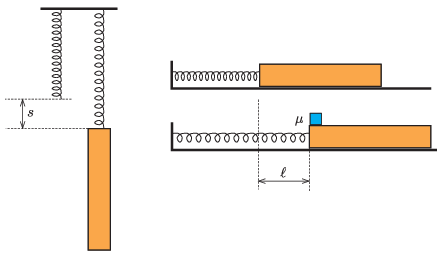

P. 5462. Elhanyagolható tömegű rugóhoz hosszú hasábot erősítünk. Ha a rugót a másik végénél fogva felfüggesztjük, megnyúlása $s=15$ cm lesz. Ezután a rugót és a hasábot vízszintes, súrlódásmentes síkra helyezzük, és a rugó szabad végét rögzítjük. A hasábot az  ábrán látható módon $\ell$ távolsággal hátrahúzzuk, így a rugó megnyúlik. Végül a hasáb felső lapjára, annak rugó felőli végére egy kocka alakú testet helyezünk. A hasáb és a kocka közötti (tapadási és csúszási) súrlódási együttható $\mu=0{,}2$.

 Ha a hasábot elengedjük, a rendszer mozgásba jön, és a kocka elcsúszik a hasábon. A két test közötti csúszás azt a pillanatot követően szűnik meg, amikor a hasáb gyorsulása nullává válik.
 $a)$ Mennyi ideig csúszott a kocka a hasábon?
 $b)$ Legalább mekkora az $\ell$ távolság, ha a leírt mozgás létrejöhetett?
 $c)$ Mekkora távolsággal csúszott el a kocka a hasábon?

